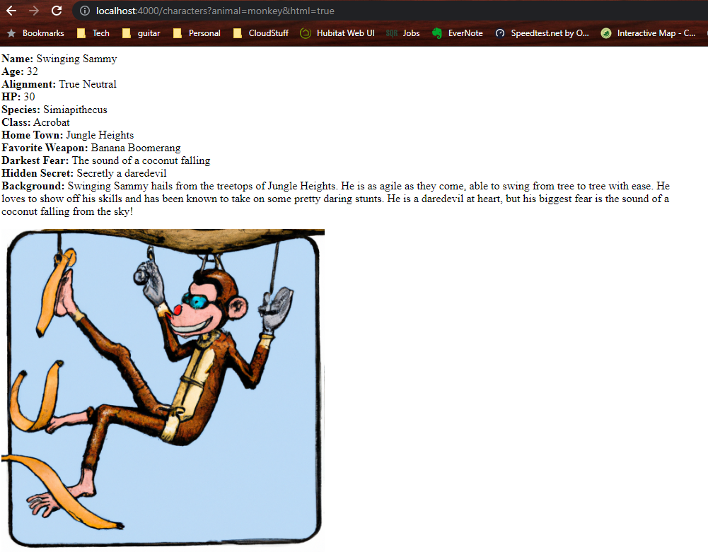
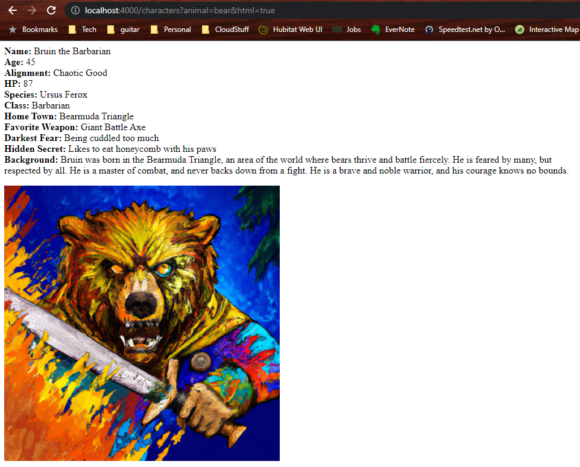
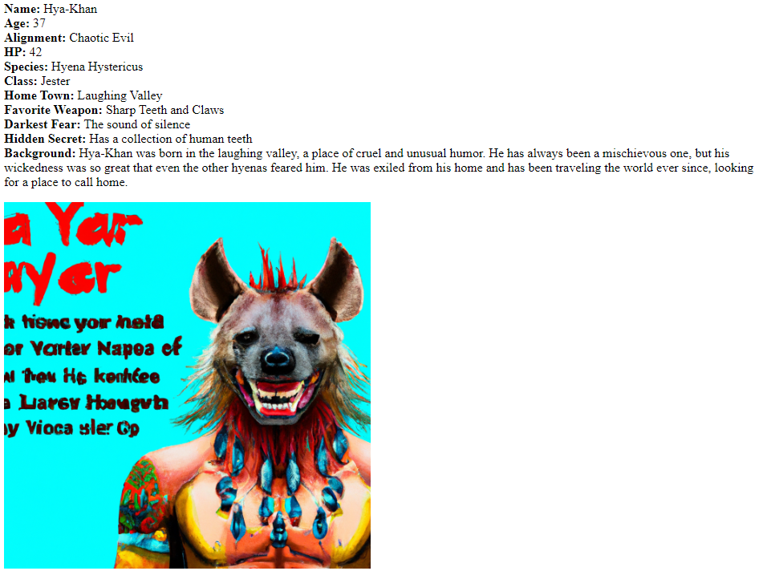

# OpenAI API Example Usage

This is a collection of example projects in NodeJS that makes use of the OpenAI API. This project includes example code that uses AI to generate RPG characters, including interesting personalities, story backgrounds, and a generated portait to with it.

You will need to create an [API Key on the OpenAI website](https://beta.openai.com/account/api-keys) before continuing.

There is [an example of this project deployed to AWS Lambda]( https://4l8lmpmgh9.execute-api.us-east-1.amazonaws.com/character-generator).

Here are some example RPG characters generated by OpenAI: 





## Prereqs

* NodeJS + NPM
* Git

## Install and Run

1. Clone this repo

    ```bash
    $ git clone https://github.com/coatsnmore/openapi-examples
    $ cd openapi-examples
    ```

2. Install the requirements

   ```bash
   $ npm install
   ```

3. Make a copy of the example environment variables file

   On Linux systems: 
   ```bash
   $ cp .env.example .env
   ```
   On Windows:
   ```powershell
   $ copy .env.example .env
   ```

4. Add your [API key](https://beta.openai.com/account/api-keys) to the newly created `.env` file

5. Run the CLI

    ```bash
    $ npm run cli
    ```

6. Run the API

    ```bash
    $ npm run api
    ```

### Some Interesting Reads

* [Sampling Temperature and Language Models](https://towardsdatascience.com/how-to-sample-from-language-models-682bceb97277)
